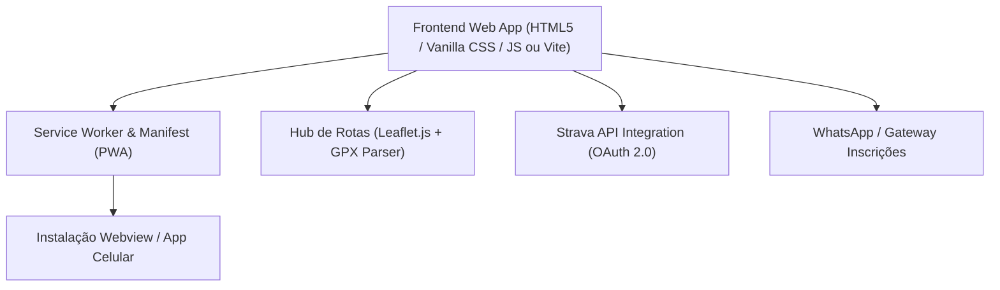

# 🗺️ Master Blueprint: Plano de Desenvolvimento - Ciclismo Santa Helena

Este documento serve como o **Guia Mestre de Arquitetura, Especificações e Roadmap de Desenvolvimento** do projeto **Ciclismo Santa Helena (Cycling Hub & App)**.

Toda a preparação foi estruturada para que você possa desenvolver o projeto passo a passo dentro do **Antigravity IDE**.

---

## 🎯 1. Visão Geral do Produto (Product Vision)

### O Problema
Associações de ciclismo regionais frequentemente dependem apenas de redes sociais (Facebook/Instagram) e grupos de mensagens, o que dificulta:
- A organização centralizada de calendários de eventos e inscrições.
- O acesso a mapas digitais e altimetria das trilhas locais.
- A avaliação comunitária da qualidade e segurança dos percursos.
- O engajamento com patrocinadores locais e pontos de apoio.

### A Solução (Ciclismo Santa Helena Hub & PWA)
Uma plataforma digital moderna, rápida e instalável como App (PWA/Webview) que atua como o **Hub Oficial do Ciclismo em Santa Helena - PR**:
1. **Portal Institucional & Galeria**: Exibição da história da associação, mídias raspadas e apoiadores.
2. **Grade de Eventos & Inscrições**: Calendário detalhado dos passeios de cicloturismo e desafios MTB com checkout/WhatsApp.
3. **Hub de Rotas & Avaliação**: Ferramenta de criação, compartilhamento, mapa interativo, arquivo GPX e avaliações comunitárias.
4. **Integração Strava API**: Sincronização automática de treinos, altimetria e ranking de segmentos regionais.
5. **App PWA / Webview**: Funciona no navegador e pode ser instalado direto no celular.

---

## 🔥 2. Análise dos Templates Benchmark (Version 1 & Version 2 via Firecrawl CLI)

Extraímos e convertemos as duas versões do template referência (**[Cycling Version 1](https://kamleshyadav.com/html/cycling/version-1/index.html)** e **[Cycling Version 2](https://kamleshyadav.com/html/cycling/version-2/index.html)**) utilizando o **Firecrawl CLI**:

| Versão Benchmark | Arquivo Parsed (Markdown) | HTML Original | Destaques Selecionados |
| :--- | :--- | :--- | :--- |
| **Version 1** | [`scripts/cycling_v1_parsed.md`](file:///home/horyu/Projetos/ciclismo/scripts/cycling_v1_parsed.md) | [`scripts/cycling_v1.html`](file:///home/horyu/Projetos/ciclismo/scripts/cycling_v1.html) | Layout clássico, grade de estatísticas numéricas (Km, Membros, Prêmios) e lista de eventos em cartões verticais. |
| **Version 2** | [`scripts/cycling_v2_parsed.md`](file:///home/horyu/Projetos/ciclismo/scripts/cycling_v2_parsed.md) | [`scripts/cycling_v2.html`](file:///home/horyu/Projetos/ciclismo/scripts/cycling_v2.html) | Hero Slider panorâmico widescreen, tabela de classificação (Leaderboard) de tempos e layout moderno de notícias. |

### Híbrido Recomendado para o Cliente:
Combinamos o melhor das duas versões:
- **Da Version 1**: A clareza dos dados institucionais, o grid de estatísticas do clube e os cartões simples de eventos.
- **Da Version 2**: O Hero Slider de alto impacto para fotos do Balneário Terra das Águas e o módulo de classificação dos pedais.

---

## 🎨 3. Design System & Identidade Visual

### Logo Oficial da Marca
Salva em alta resolução em: [`midias/logo/logo_ciclismo_santa_helena.jpg`](file:///home/horyu/Projetos/ciclismo/midias/logo/logo_ciclismo_santa_helena.jpg)

### Paleta de Cores
```css
:root {
  --primary-orange: #FF5722;     /* Ação, Energia, Botões principais, Strava Accent */
  --accent-yellow:  #FFC107;     /* Destaques, Estrelas de Avaliação, Pódio */
  --bg-dark:        #0B192C;     /* Background elegante em Dark Mode */
  --bg-card:        rgba(15, 32, 56, 0.75); /* Cards Glassmorphism */
  --forest-green:   #1E5128;     /* Natureza, Trilhas MTB, Selos Ecológicos */
  --text-white:     #FFFFFF;     /* Texto Principal */
  --text-muted:     #A0AEC0;     /* Textos Secundários e Metadados */
}
```

### Tipografia
- **Títulos & Headings**: `Outfit` (Google Fonts, Bold / Heavy)
- **Textos de Corpo**: `Inter` (Google Fonts, Regular / Medium)

*Manual da Marca TXT gerado em:* [`midias/manual_da_marca.txt`](file:///home/horyu/Projetos/ciclismo/midias/manual_da_marca.txt)

---

## 🛠️ 4. Arquitetura Técnica Recomendada



---

## 📋 5. Roadmap de Desenvolvimento (Backlog de Sprints)

### 📌 Sprint 1: Setup do Projeto & Design System Base
- [x] Criar estrutura de arquivos no Antigravity IDE (`index.html`, `css/style.css`, `js/app.js`).
- [x] Extrair e analisar os templates Cycling Version 1 & Version 2 com Firecrawl CLI.
- [x] Definir tokens de cores, tipografia `Outfit`/`Inter` e componentes de layout.

### 📌 Sprint 2: Perfil Institucional & Galeria de Mídias
- [ ] Implementar Hero Section combinando Version 1 e 2.
- [ ] Criar contador de estatísticas (Km percorridos, membros ativos, eventos realizados).
- [ ] Desenvolver componente de Galeria Responsiva consumindo os 5 álbuns curados (`albuns_curados/`).

### 📌 Sprint 3: Grade de Eventos & Inscrições
- [ ] Criar cards de próximos eventos baseados na Version 1 e 2.
- [ ] Adicionar botão de inscrição direta via WhatsApp ou formulário integrado.

### 📌 Sprint 4: Hub de Rotas & Sistema de Avaliações
- [ ] Implementar formulário de cadastro de rotas (Nome, Distância Km, Elevação m, Modalidade, Pontos de Apoio).
- [ ] Integrar mapa interativo com `Leaflet.js` para visualização dos percursos.
- [ ] Desenvolver componente de avaliação da comunidade (1 a 5 estrelas + comentários).
- [ ] Adicionar gerador/download de arquivo `.gpx`.

### 📌 Sprint 5: Conexão Strava API (OAuth2)
- [ ] Configurar fluxo de autorização OAuth 2.0 (`/oauth/authorize`).
- [ ] Importar últimas atividades do atleta conectado (`GET /athlete/activities`).
- [ ] Exibir ranking regional de segmentos/subidas locais (KOM/QOM Santa Helena).

### 📌 Sprint 6: Empacotamento PWA & Webview
- [ ] Validar manifesto PWA (`manifest.json`) e Service Worker (`sw.js`).
- [ ] Testar instalação em dispositivos móveis e wrapper Webview para loja Android.
